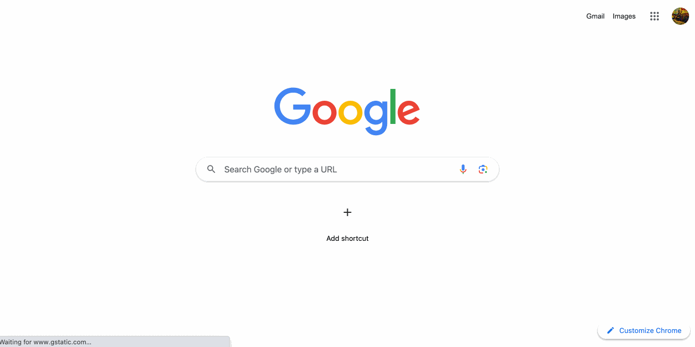

DeltaHub
==============================

  

A platform and cloud-based data sharing service based on the Delta Sharing protocol. It's neither a data catalog
nor a data repository, nor a data marketplace. DeltaHub is a service focused solely on data sharing.
It provides only the minimum governance features necessary for data sharing, but allows users to easily search and
share the data they bring.

Screenshot
==============================

  

