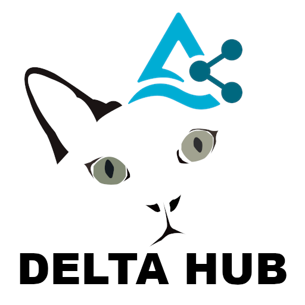
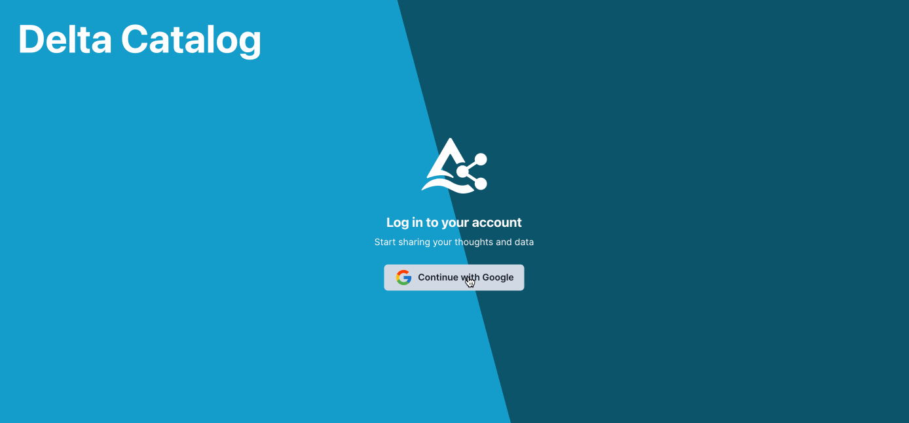

DeltaHub
==============================

<p float="left" align="center">
  
</p>

A platform and cloud-based service for data sharing based on delta-sharing-rs using Next.js and TypeScript.
Please refer to the [Project Improvement Proposal](./dev/README.md).

Screenshot
==============================

<p float="left" align="center">
  
</p>

Atomic Design
==============================

We have adopted the [Atomic Design Methodology](https://atomicdesign.bradfrost.com/) for structuring UI components, but some modifications are required.
The original methodology primarily emphasizes a bottom-up approach starting from basic HTML tags. However, in our case,
we use Chakra UI components as our foundational elements, equivalent to atoms in the original methodology.

The following list explains the guide-line how to structure of your components' hierarchy

 - Atoms

According to the original methodology, atoms should correspond to Chakra UI components, so there seems to be no need to
implement atomic components in this project. However, we redefine atoms as undecomposable components in the context of
the project. For example, a component that consists of one icon element and one line of text, such as menu items, should be
considered a molecule from the perspective of the original methodology. Still, we treat it as an atom since we don't 
decompose it in our implementation. Of course, the atomic components from the Chakra UI are also considered and treated
as atoms.

 - Molecules

Molecules are constructed from the atoms as explained in the previous section. A typical example of a molecule is a container
component, such as lists and tables. Molecules do not differ from the original methodology, except for the underlying atoms.

 - Organisms

Organisms correspond to the so-called "areas" on a web page. For example, header area, footer area, main pane, left pane, and form areas.

 - Templates / Pages
 
Templates and pages correspond to the [layouts and pages](https://nextjs.org/docs/pages/building-your-application/routing/pages-and-layouts) of [Next.js](https://nextjs.org/).
Hence, we don't prepare any designated directories for the templates' and/or pages' implementations.

DeltaHub Configuration
==============================

| Name                       | Environment Variable     | Required | Description                                                                                               |
|:--------------------------:|:------------------------:|:--------:|-----------------------------------------------------------------------------------------------------------|
| `nextauth_url`             | NEXTAUTH_URL             | yes      | Your canonical URL                                                                                        |
| `next_public_nextauth_url` | NEXT_PUBLIC_NEXTAUTH_URL | yes      | Your canonical URL which will be used for client side rendering (This should be the same as NEXTAUTH_URL) |
| `nextauth_secret`          | NEXTAUTH_SECRET          | yes      | Your NextAuth JWT encryption secret                                                                       |
| `google_client_id`         | GOOGLE_CLIENT_ID         | yes      | Google API client ID for OIDC                                                                             |
| `google_client_secret`     | GOOGLE_CLIENT_SECRET     | yes      | Google API client secret for OIDC                                                                         |
| `github_client_id`         | GITHUB_CLIENT_ID         | yes      | GitHub API client ID for OIDC                                                                             |
| `github_client_secret`     | GITHUB_CLIENT_SECRET     | yes      | GitHub API client secret for OIDC                                                                         |
| `delta_sharing_base_url`   | DELTA_SHARING_BASE_URL   | yes      | Delta Sharing RS Backend URL                                                                              |

Obtaining Authentication Credentials
==============================

To use Google's OAuth 2.0 with Delta Catalog via NextAuth, you will need Google's OAuth 2.0 authentication credentials, which include a client ID and client secret. Here is the process for obtaining them:

1. Access the Google Developer Console.
2. Create a new project.
3. Create the OAuth consent screen.
4. Register your application and obtain authentication credentials (client ID and client secret).

To use GitHub's OAuth 2.0 with Delta Catalog via NextAuth, you will need GitHub's OAuth 2.0 authentication credentials, which include a client ID and client secret. Here is the process for obtaining them:

1. Access the GitHub Developer Settings.
2. Create a new OAuth App.
3. Create the OAuth consent screen.
4. Register your application and obtain authentication credentials (client ID and client secret).

Getting the JWT Secret
==============================

NextAuth uses JWT (JSON Web Tokens) to manage sessions. The JWT secret is used for signing JWTs. It should be a random string.
The following example demonstrates how to generate a JWT secret using the `openssl` command.

```bash
$ openssl rand -base64 32
IHPcQI71tUBPOJ7jxkRhjKRv7Ak5nvnz9xCZEPBeN8U=
```
